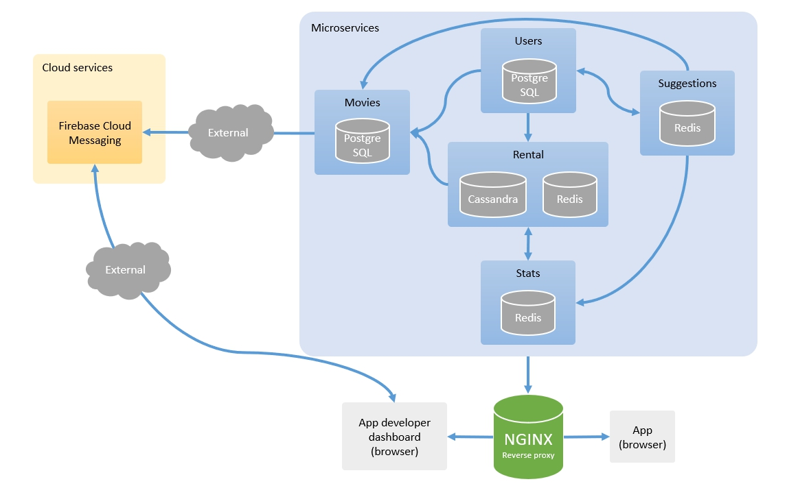

# Architecture

## Schéma

## Users

Contient les données des utilisateurs. Choix d'une base de données SQL (PostgreSQL) afin de pouvoir faire des requêtes riches sur les clients.

Il permet à l'utilisateur de récupérer la liste des suggestions de films auprès du microservice [Suggestions](#suggestions).

L'utilisateur peut récupérer le catalogue de films via des recherches ou une référence de film auprès du microservice [Movies](#movies).

Lorsqu'un choix a été fait, la location est demandée au microservice [Rental](#rental).

## Suggestions

Récupère auprès du microservice [Stats](#stats) l'historique de visionnage d'un utilisateur et génère périodiquement des suggestions (sous forme de références `movie_id`) qu'il conserve en mémoire sur une base Redis.

J'ai choisi Redis car les suggestions sont des données assez temporaires et qui ont besoin d'être délivrées le plus rapidement possible à l'application.

## Movies

Catalogue qui référence les films disponibles, leur réalisateur et acteurs. Il est connecté au service Cloud [Firebase Cloud Messaging](https://firebase.google.com/docs/cloud-messaging/) afin de délivrer aux développeurs les notifications d'ajout ou d'archivage de film, ainsi que leurs changements de tarif en temps réel (Pub/Sub).

## Rental

S'occupe des demandes de location de films. J'ai choisi une base de données NoSQL (Apache Cassandra) afin d'enregistrer toutes ces demandes le plus efficacement possible.

La base en mémoire Redis sert à sauvegarder en cache l'avancement de lecture des films par les utilisateurs, et s'ils sont actuellement entrain d'en visionner.

Lors de la location ou visionnage d'un film, des appels sont faits au microservice [Stats](#stats) afin d'en produire des statistiques.

## Stats

Service d'analytics contenant un bot qui va récupérer auprès du microservice [Rentals](rentals) les informations sur les locations de films afin de générer des rapports.

Il pourrait être remplacée par un service Cloud (comme [Google Analytics](https://firebase.google.com/docs/analytics)) qui s'occuperait d'auto-génerer les rappots.

## Reverse Proxy

S'occupe de la réecriture des URI pour unifier les microservices en une seule et même API. Sert également l'application frontend aux utilisateurs.

Peut être remplacé par un service Cloud (avec Load Balancer).
